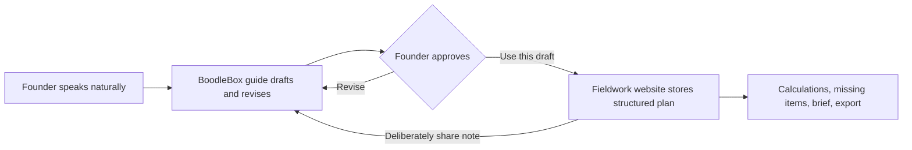

# Business Plan First Steps — Project Handoff

**Status date:** September 12, 2026

**Repository:** [github.com/denson/fieldwork](https://github.com/denson/fieldwork)

**Live activity:** [Business Plan First Steps](https://denson.github.io/fieldwork/?demo=business&step=idea)

**Live BoodleBox bot:** [Business Plan First Steps](https://box.boodle.ai/a/@BusinessPlanFirstSteps)

**Session record:** [business-plan-first-steps-session.json](business-plan-first-steps-session.json)

## Executive summary

Business Plan First Steps is a chat-first business-planning lesson built from a BoodleBox bot, a structured Fieldwork website, and an optional Chrome extension. It is meant for someone who may never have written a business plan. The person describes an idea naturally; the bot turns that conversation into useful draft wording; the person approves or revises it; and the website organizes, preserves, calculates, and exports the plan.

The product is deliberately not a chatbot sitting beside a conventional form. Its core loop is:

> **Say it naturally → receive a useful draft → approve or revise it → see it organized on the website → continue the conversation.**

The latest published version fixed the most important early failure: after a user described an idea, the bot had instructed them to retype it into fields. The current bot instead proposes a temporary business name, drafts the offer sentence, and can provide a bounded one-step transfer that the user explicitly approves with **Use this draft**.

The next design change has been agreed but is not yet implemented: replace the overly self-referential **Boodle-Ready Sites** fictional plan with a technical, understandable lead-paint/asbestos property-testing business, and add a beginner-friendly **Licenses, safety, and rules** stage to the planning process.

## What BoodleBox is in this project

At its core, BoodleBox provides:

- a selection of underlying AI models;
- configurable custom bots with instructions, greeting, profile, and sharing;
- uploaded document knowledge with retrieval/context behavior;
- shared organizational knowledge and bot-level knowledge;
- conversations that can include multiple bots and people;
- a bot builder a non-programmer can inspect and edit.

The important opportunity is not merely model selection or document RAG. BoodleBox can be treated as a practical authoring and delivery environment. Denson's likely role is an **AI instructional prototype developer**: take a teacher's lesson, build a strong first bot and companion activity, test it, then hand the teacher an editable draft rather than asking the teacher to design the entire AI interaction from scratch.

MCP is not central to the value proposition for this project. The owner's current view is that the newer Anthropic MCP direction may improve enough that BoodleBox will not need to invent a separate internal CLI simply to replace MCP. Either way, Business Plan First Steps should not depend on speculative MCP capabilities; its useful behavior already comes from bot instructions, attached knowledge, the website, and an explicit user-controlled transfer.

### Account and integration snapshot

The official pages were rechecked on September 12, 2026. BoodleBox lists:

| Plan | Published price | Relevance |
|---|---:|---|
| Basic | Free | Multiple models, custom bots, knowledge uploads, collaboration, unlimited Basic-model prompts, and five Premium-model prompts per day. |
| Premium | $20/month; $16 for Education | Premium models, teams, Premium-powered bots, up to 10 documents per chat, and a 15 GB Knowledge Bank. |
| Power | $100/month or $1,080/year | Up to 100 documents per chat, a 100 GB Knowledge Bank, beta Deep Research, and early access to Skills, MCPs, and plugins. |
| Enterprise | Custom | Organization-wide administration, training, analytics, security, and custom integrations including LMS connections. |

The current [pricing page](https://boodlebox.ai/pricing) advertises MCP/plugin access but the current [FAQ](https://boodlebox.ai/faq) still says there is no general API for integrating BoodleBox with other institutional software. Those statements can coexist: early or managed MCP/plugin capability is not the same thing as a public general-purpose API. Do not assume that buying Power automatically provides every external-development capability; confirm access, documentation, authentication, deployment, logs, and workspace transfer before building around it.

Useful questions remain:

- Can an independent developer connect and test a remote MCP server, and which transports and authentication methods are supported?
- Can ordinary custom bots invoke those tools, and what permissions, review, quotas, logs, and debugging facilities exist?
- Can bot, knowledge, and tool definitions be exported, versioned, and transferred into a PCCLD workspace?
- Can an institutional connection be used without exposing credentials to patrons?
- What data from chats, files, models, and tool calls is retained or visible to administrators?
- What constraints apply when an activity involves children?

Technical support is currently listed as `success@boodle.ai` on the FAQ.

## PCCLD opportunity and original project context

This work began because Pueblo City-County Library District was starting a BoodleBox initiative. The original goal was to understand the platform, find the responsible people at PCCLD and BoodleBox, and determine how Denson could contribute useful educational experiences. The goal was not to pitch a large speculative product or to build an integration before access and need were understood.

The durable opportunity that emerged is a repeatable service:

1. A teacher or librarian explains the audience, learning objective, source material, and common difficulties.
2. Denson builds a working first draft in BoodleBox: instructions, greeting, knowledge, examples, and a test conversation.
3. When structure or calculation matters, a small Fieldwork companion site supplies the deterministic workspace.
4. The educator tests the experience and edits it in BoodleBox instead of starting from a blank bot builder.
5. The result is handed over with source files, versioned knowledge, test cases, and clear publication steps.

This positions Denson as an instructional prototyper and collaborator, not merely a prompt writer and not necessarily an MCP infrastructure vendor.

Questions for PCCLD still include who owns the deployment, which audiences and programs are in scope, whether an outside collaborator can receive a workspace or pilot role, and what policies govern accessibility, privacy, minors, content review, evaluation, and approved integrations.

### Earlier demonstration concept: subitizing

Before Business Plan First Steps became the working demonstration, the project identified an early-numeracy activity for a five-year-old: recognizing small quantities in familiar and unfamiliar arrangements without always counting each item. The precise learning target is **subitizing**, especially transfer across noncanonical finger, dot, object, sound, or movement patterns.

A responsible version would distinguish **recognized immediately**, **counted correctly**, and **not sure**; treat counting as a valid strategy; teach part-whole structures such as two and one making three; and adapt later examples to the child's response. Exact quantity cards must be vetted rather than trusted to generative imagery. A chat alone may not reliably flash and hide a card on a precise timer, so an adult-mediated or deterministic web component may be necessary. The experience should feel like play, avoid diagnosis, and make privacy and adult consent explicit before retaining any child data.

This remains a possible future lesson, not part of the Business Plan First Steps release.

### Project ownership history and coordination

The first Business Plan First Steps implementation was created in a separate Codex task titled **Identify Allan Tormohlen** for a September 9 follow-up demonstration for Alan. This BoodleBox-overview task later located the work, took ownership, reviewed it, implemented and published the improvement batches, and resolved the bot-knowledge attachment.

A reminder was arranged for 9:00 a.m. Mountain Time on September 21, 2026, one day before the PCCLD BoodleBox welcome reception and Lunch & Learn scheduled for September 22.

## Product responsibilities

### The guide is the conversational co-author

The bot should listen, infer useful field wording from what was already said, offer reasonable names and phrasing, distinguish evidence from assumptions, explain unfamiliar concepts, and ask only one important follow-up at a time. It should say **I drafted** or **I revised**, never claim it saved or filled the website.

### The website is the visible working document

The website keeps approved material organized and editable, preserves the draft in the browser, supports an optional longer-lived local copy and private JSON backup, performs deterministic calculations, identifies missing information, and produces a planning brief that can be downloaded as Markdown or printed to PDF.

### The user remains in control

The extension never silently transfers answers. The user chooses **Use this draft** before bot wording changes a website step, and chooses **Put note in BoodleBox** before a website note enters chat. Without the extension, the same exchange works by copy and paste. Freeform answers are never placed in URLs.

## Current published experience

The published activity has six stages:

1. **Idea:** working name and a plain-language description of the business.
2. **Customer:** first customer group, its problem, and what is actually known.
3. **Offer:** one purchase, alternatives, first marketing channel, delivery, and requirements.
4. **Numbers:** price, variable cost, fixed costs, expected sales, optional capacity, startup spending, and desired owner pay.
5. **Test:** a small real-world test, useful signal, next action, and adviser question.
6. **Review:** a structured planning brief with gaps, assumptions, risks, adviser questions, and export controls.

Reviewer feedback is intentionally separate at [reviewer mode](https://denson.github.io/fieldwork/?demo=business&step=review&reviewer=1). The site does not send email, store submissions on a server, or claim feedback was delivered. Business-plan answers are excluded from the feedback package unless the reviewer explicitly includes them.

The calculator uses these rules:

- Revenue = price × monthly sales.
- Variable costs = cost per sale × monthly sales.
- Operating remainder = revenue − variable costs − monthly fixed costs.
- Contribution per sale = price − cost per sale.
- Break-even sales = the next whole sale at or above fixed costs ÷ positive contribution.
- Sales for desired owner pay = the next whole sale at or above (fixed costs + desired owner pay) ÷ positive contribution.
- Blank is not zero, and a non-positive contribution cannot reach either target in this model.

The operating remainder is before owner pay, taxes, debt payments, and recovery of startup spending. The model is an educational first pass, not a cash-flow forecast, lender decision, valuation, or proof of viability.

## Published technical state

| Component | Verified state |
|---|---|
| Git repository | `https://github.com/denson/fieldwork.git`, branch `main` |
| Current published source commit | `efbce7a9e2ecfa5a74d27b73bde1d366a0c68ccf` — `Expand business plan bot knowledge` |
| Website | GitHub Pages from `portfolio/` |
| Bot alias | `BusinessPlanFirstSteps` |
| Bot editor ID | `8ff50065-515b-40ee-b266-489c972ca9c9` |
| Bot model at verification | ChatGPT 5-mini |
| Bot behavior | v1.3 chat-first instructions, greeting, description, and draft-transfer schema published |
| Bot knowledge | `business-plan.md` attached to this bot and published |
| Extension | Fieldwork Companion Pane `0.8.0` with user-approved transfer in both directions |
| Automated verification | 33 tests passed for the latest published knowledge expansion |

The canonical public sources are:

- [`portfolio/lessons/business-plan.md`](../lessons/business-plan.md): bot knowledge and full teaching reference.
- [`portfolio/lessons/business-plan-bot-instructions.md`](../lessons/business-plan-bot-instructions.md): exact bot behavior and transfer contract.
- [`portfolio/lessons/business-plan-greeting.md`](../lessons/business-plan-greeting.md): published greeting.
- [`portfolio/lessons/business-plan-description.md`](../lessons/business-plan-description.md): bot profile description.
- [`portfolio/business-core.js`](../business-core.js): fictional plans, calculations, brief, backup, and feedback formatting.
- [`portfolio/business.js`](../business.js): activity UI and browser draft behavior.
- [`chrome-extension/manifest.json`](../../chrome-extension/manifest.json): extension version and allowed surfaces.
- [`PUBLISHING.md`](../../PUBLISHING.md): release and cache-busting procedure.

## Knowledge attachment: the distinction that caused confusion

BoodleBox has separate scopes that should not be conflated:

1. **Conversation attachment:** a document available only in one chat.
2. **Knowledge Bank item:** a persistently uploaded account asset, but not automatically used by a bot.
3. **Bot knowledge attachment:** a Knowledge Bank item selected in the bot builder and made part of that bot's configuration.
4. **Published bot configuration:** the attachment and any instruction changes become live only after publishing.

The final verified state is correct: `business-plan.md` exists in the Knowledge Bank, is attached specifically to Business Plan First Steps in the bot builder, and the bot was published with no remaining unpublished changes. A new conversation does not need the file manually attached as a chat document.

The attachment is a snapshot, not a live Git subscription. Whenever the canonical Markdown changes, the BoodleBox copy must be updated or re-uploaded, attached if necessary, and the bot republished. A GitHub Pages deployment alone does not update the bot's attached knowledge.

Global **Auto Attach to All New Chats** is not appropriate: this knowledge belongs to this bot, not every unrelated conversation.

## Information and safety rules

When facts conflict, the guide should use this precedence:

1. the user's newest explicit correction or decision;
2. the newest website note the user deliberately shared;
3. earlier draft language from the same conversation;
4. fictional examples, which are teaching scaffolds only and never evidence about the user's business.

The bot should draft when enough information exists, label uncertainty as an assumption, and leave genuinely unknown material blank. It must not invent interviews, customer demand, prices, costs, licenses, permit rules, laboratory results, or proof that an idea will work.

## Current fictional examples

The live activity currently offers three complete first drafts:

- **Boodle-Ready Sites:** an AI-friendly guided-website studio.
- **Mesa Yard Care:** scheduled cleanup and manual weeding for small yards.
- **Porchside Bike Tune-Ups:** a limited mobile bicycle-service package.

Each includes a customer, offer, evidence label, monthly model, capacity, next test, and adviser question. They are fictional and must never be copied into a user's plan without the user's choice.

The owner has rejected Boodle-Ready Sites as the long-term example. It is too meta, too close to this project, and less immediately understandable than the lesson needs.

## Agreed replacement: SafeStart Property Testing

The proposed replacement is a more complex, regulated, and still recognizable technical business. A careful working description is:

> **SafeStart Property Testing** uses specialized equipment to collect lead-paint measurements and safely collects suspected asbestos samples for accredited laboratory analysis. Lead readings are reviewed, interpreted, and documented back at the office; asbestos findings depend on the laboratory. The customer receives a formal report for renovation or property-planning decisions.

The example must not imply that an XRF reading automatically produces an official onsite answer. It must distinguish:

- field measurement and sample collection;
- later review, interpretation, quality control, and documentation;
- accredited laboratory analysis for asbestos samples;
- the eventual report and the boundaries of what the business is qualified to conclude.

The plan should surface the business consequences of certification, calibrated equipment, safe sampling procedures, laboratory relationships, reporting, insurance, training, recordkeeping, and jurisdiction-specific rules. These are subjects to verify, not legal conclusions the bot should fabricate.

Official starting references identified during design discussion:

- [EPA: Lead abatement, inspection and risk assessment](https://www.epa.gov/lead/lead-abatement-inspection-and-risk-assessment)
- [EPA: Asbestos professionals](https://www.epa.gov/asbestos/asbestos-professionals)

Mesa Yard Care remains useful precisely because it shows a different degree of complexity. Even a simple service can involve equipment, transport, insurance, safe work scope, pesticides, garden chemicals, and local rules. Narrowing the offer to cleanup, mowing, and manual weeding reduces some risk; it does not mean the business has no regulatory or technical questions.

## Agreed new stage: Licenses, safety, and rules

Add a beginner-friendly stage between **Offer** and **Numbers**. Avoid presenting it as a legal-compliance form. Its purpose is to help the founder recognize work that must be verified and budgeted before the first paid job.

Suggested conversational opening:

> What parts of this work might require permission, certification, insurance, special training, or careful handling before you can sell it?

The stage should help the founder create **Things to verify before launch**, including where relevant:

- licenses, certifications, permits, inspections, or accredited laboratories;
- chemical, equipment, worker, customer, property, health, and data risks;
- insurance, training, calibration, protective equipment, and recordkeeping;
- requirements that must be met before accepting a first paid job;
- the agency, insurer, laboratory, adviser, or qualified professional who can verify an answer;
- startup, per-job, and recurring compliance costs that belong in the financial model.

The bot's job is to help identify categories and formulate verification questions. It must not claim that a business is compliant or issue legal, environmental, health, or licensing determinations. This stage should feed the offer, costs, capacity, launch timing, risk list, and adviser questions rather than becoming an isolated checklist.

## Remaining implementation work

This work is not yet in the public activity or the attached bot knowledge:

1. Replace Boodle-Ready Sites with a complete SafeStart Property Testing fictional plan in the website data and canonical knowledge.
2. Add the **Licenses, safety, and rules** stage to navigation, fields, local draft schema, structured brief, backup/import format, progress logic, chat-note handoff, and return-transfer schema.
3. Update the bot instructions, greeting/example language, and worked-example guidance to use the new example and stage.
4. Add calculator connections for one-time, per-sale, and recurring compliance costs without pretending they are known before research.
5. Extend automated tests for the new stage, backward-compatible imports, extension payload validation, and final brief.
6. Run the complete suite and browser integration pass, commit, push to `main`, and verify GitHub Pages rather than relying only on the workflow badge.
7. Update the `business-plan.md` snapshot in BoodleBox, verify that it remains attached to the bot, publish the bot, and confirm there are no unpublished changes.
8. Start a fresh bot conversation and verify the complete loop: natural-language idea → name and offer draft → **Use this draft** → website update → shared note → continued conversation.

## Release discipline

- Run `node --test portfolio/tests/*.test.cjs` from the repository root.
- When changing JavaScript or CSS, update the version query in every HTML entry point that loads it so GitHub Pages visitors do not retain stale assets.
- Preserve the `.gitignore` allowlist. Public handoff material belongs under `portfolio/` unless the allowlist is deliberately changed.
- Reload the unpacked extension only after extension-code changes; ordinary website content or bot-instruction changes do not require an extension reload.
- Never treat a successful deployment as proof that an already-open browser tab loaded the new asset.
- Publish bot instructions, greeting, description, and knowledge separately in BoodleBox; Git does not publish those settings.

## Session record scope

The adjacent JSON file is a faithful export of visible user and assistant messages from this Codex task through the handoff request on September 12, 2026. It excludes system/developer instructions, environment injections, tool calls and outputs, hidden reasoning, secrets, and post-request implementation chatter. It preserves message timestamps, assistant phase (`commentary` or `final_answer`), and message text. The referenced older ChatGPT conversation appears only to the extent it was included in the user's visible opening message; this export does not silently merge the older thread into the Codex transcript.
